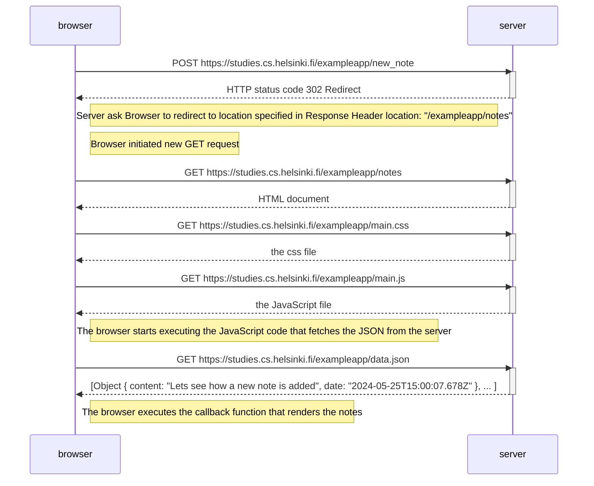

# Exercise 0.4

```mermaid
  sequenceDiagram
    participant browser
    participant server

    browser->>server: POST https://studies.cs.helsinki.fi/exampleapp/new_note
    activate server
    server-->>browser: HTTP status code 302 Redirect
    deactivate server

    Note right of browser: Server ask Browser to redirect to location specified in Response Header location: "/exampleapp/notes"
    Note right of browser: Browser initiated new GET request

    browser->>server: GET https://studies.cs.helsinki.fi/exampleapp/notes
    activate server
    server-->>browser: HTML document
    deactivate server

    browser->>server: GET https://studies.cs.helsinki.fi/exampleapp/main.css
    activate server
    server-->>browser: the css file
    deactivate server

    browser->>server: GET https://studies.cs.helsinki.fi/exampleapp/main.js
    activate server
    server-->>browser: the JavaScript file
    deactivate server

    Note right of browser: The browser starts executing the JavaScript code that fetches the JSON from the server

    browser->>server: GET https://studies.cs.helsinki.fi/exampleapp/data.json
    activate server
    server-->>browser: [Object { content: "Lets see how a new note is added", date: "2024-05-25T15:00:07.678Z" }, ... ]
    deactivate server

    Note right of browser: The browser executes the callback function that renders the notes
```
