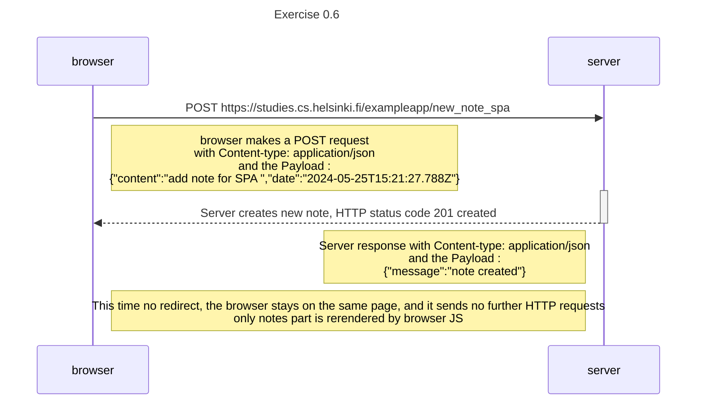

```mermaid
sequenceDiagram
title Exercise 0.6 
  participant browser
  participant server

  browser->>server: POST https://studies.cs.helsinki.fi/exampleapp/new_note_spa
  Note right of browser: browser makes a POST request<br/> with Content-type: application/json <br/> and the Payload :<br/> {"content":"add note for SPA ","date":"2024-05-25T15:21:27.788Z"}
  activate server
  server-->>browser:  Server creates new note, HTTP status code 201 created
  deactivate server
  Note left of server: Server response with Content-type: application/json <br/> and the Payload :<br/> {"message":"note created"}

  Note right of browser: This time no redirect, the browser stays on the same page, and it sends no further HTTP requests <br/> only notes part is rerendered by browser JS

```
